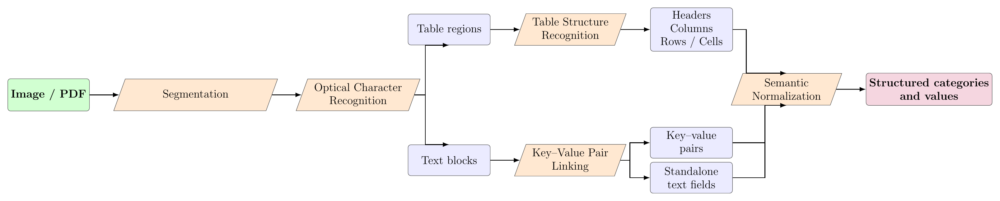
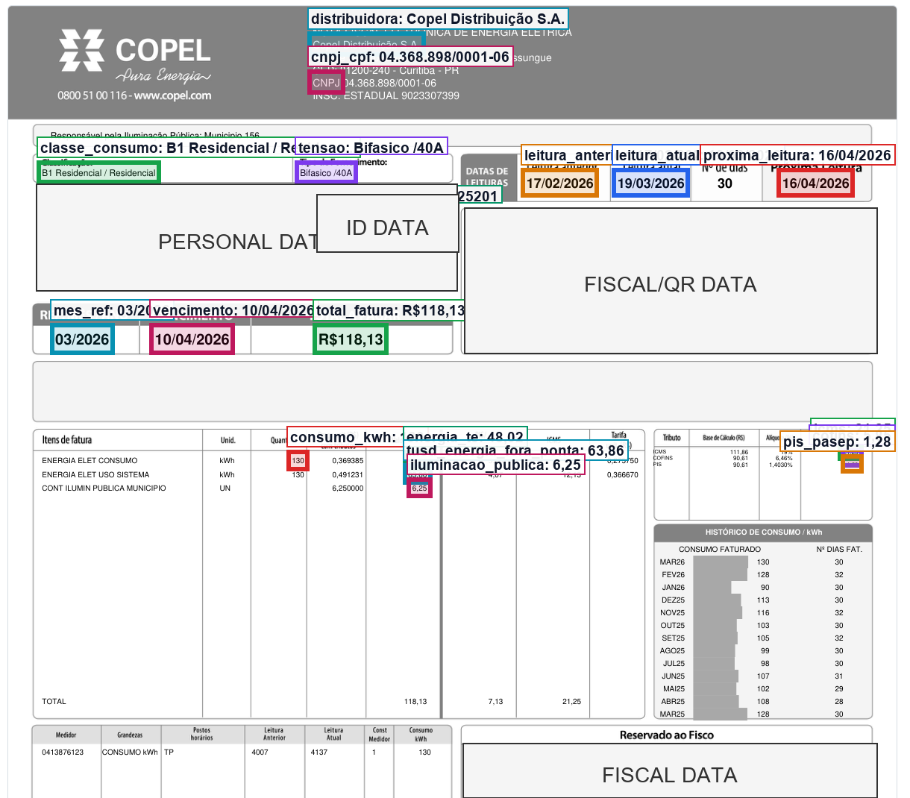
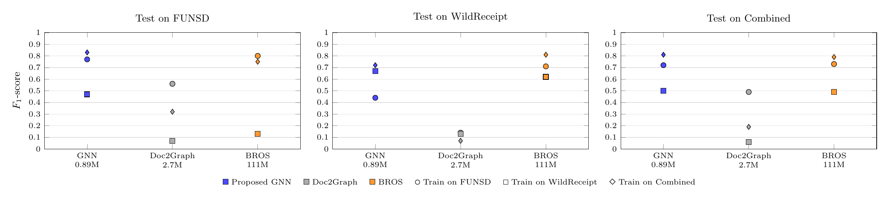

# GNN para Ligação Chave-Valor em Documentos

Implementação e scripts experimentais para extração de pares chave-valor em documentos digitalizados usando uma GNN leve com construção seletiva de arestas. O repositório também inclui componentes auxiliares de normalização semântica, tabelas e validação de pipeline usados no trabalho.

**Autores:** Gabriel Sichelero e Ricardo Dutra da Silva.



## Objetivo

Este repositório reúne os principais scripts de implementação e experimentação, com foco principal na GNN para ligação chave-valor em datasets públicos como FUNSD e WildReceipt. A organização separa o código dos dados.

Não foram incluídos datasets, checkpoints de modelos, arquivos de saída volumosos ou documentos privados. As imagens presentes em `assets/` são figuras explicativas ou exemplos anonimizados usados para contextualizar o README.

## Visão Geral



O núcleo do trabalho é o modelo GNN que representa cada documento como um grafo: blocos de texto são nós e relações candidatas chave-valor são arestas. A construção seletiva reduz pares semanticamente improváveis e concentra o treinamento em ligações `question/header -> answer/other`.

No pipeline completo, a GNN aparece como o estágio central de ligação KVP:

1. segmentação/localização de regiões do documento;
2. OCR para obter texto e coordenadas;
3. ligação chave-valor com a GNN proposta;
4. reconhecimento de estrutura de tabelas;
5. normalização semântica para categorias padronizadas;
6. saída estruturada em JSON.

## Principais Scripts

| Arquivo | Função |
| --- | --- |
| `scripts/kvp_gnn_cross_dataset.py` | Experimentos de GNN para ligação chave-valor, incluindo conversão WildReceipt -> formato FUNSD, treinamento combinado FUNSD+WildReceipt e avaliação cross-dataset. |
| `scripts/kv_extractor_ml.py` | Módulo de apoio para extração e organização de pares chave-valor usados pelo pipeline. |
| `scripts/semantic_normalization_suite.py` | Testes de normalização de valores extraídos, incluindo datas, valores monetários, números e classificação semântica. |
| `scripts/semantic_normalization_gt_context.py` | Treinamento de embeddings semânticos usando contexto de ground truth, pares KVP e cabeçalhos/linhas de tabelas. |
| `scripts/invoice_categories.py` | Vocabulário leve de categorias semânticas de faturas, usado pela normalização sem importar scripts pesados. |
| `scripts/unified_document_pipeline.py` | Pipeline completo de OCR, detecção de tabelas, extração KVP, classificação e exportação dos resultados. |
| `scripts/test_full_pipeline.py` | Script de validação ponta a ponta em imagens de faturas, com visualizações de OCR, tabelas, KVPs e categorias. |
| `scripts/run_full_pipeline_with_semantic_context.py` | Orquestrador para treinar a normalização com contexto e rodar avaliação/visualizações do pipeline. |
| `scripts/table_structure_detector.py` | Módulo de detecção e reconhecimento de estrutura de tabelas. |
| `scripts/locator_classifier.py` | Classificador auxiliar usado na etapa de categorização do pipeline integrado. |

## Resultados de Referência

Resultados da GNN nos benchmarks públicos de ligação chave-valor:

| Configuração | Resultado reportado |
| --- | --- |
| GNN treinada e testada no FUNSD | F1 = 0,772 com aproximadamente 890K parâmetros |
| GNN treinada em FUNSD+WildReceipt e testada no FUNSD | F1 = 0,832 |
| GNN treinada em FUNSD+WildReceipt e testada no WildReceipt | F1 = 0,721 |



## Como Executar

Instale as dependências principais:

```bash
pip install -r requirements.txt
```

Exemplos de execução a partir da raiz do projeto:

```bash
python scripts/kvp_gnn_cross_dataset.py
python scripts/semantic_normalization_suite.py
python scripts/test_full_pipeline.py --image caminho/para/fatura.png --output pipeline_results
```

Por padrão, os scripts assumem que estão sendo executados a partir da raiz deste repositório. Para apontar dados externos ou uma estrutura local diferente, defina:

```bash
set DOCUMENT_KVP_PROJECT_ROOT=C:\caminho\para\repositorio-ou-dados
set KVP_DATASETS_DIR=C:\caminho\para\datasets_kvp
```

No Linux/macOS, use `export` em vez de `set`.

## Dados Esperados

Os scripts podem utilizar os seguintes dados externos quando executados integralmente:

- FUNSD;
- WildReceipt;
- imagens/anotações de faturas usadas nos experimentos internos;
- checkpoints treinados previamente, quando o modo de avaliação exigir.

Esses arquivos não são redistribuídos aqui. A pasta foi intencionalmente limitada à contribuição de código, documentação e figuras leves.

## Estrutura

```text
.
├── README.md
├── requirements.txt
├── assets/
│   ├── pipeline_architecture_paper.png
│   ├── invoice_kvp_annotations_anon.png
│   └── kvp_public_protocol_paper.png
└── scripts/
    ├── kvp_gnn_cross_dataset.py
    ├── semantic_normalization_suite.py
    ├── semantic_normalization_gt_context.py
    ├── invoice_categories.py
    ├── unified_document_pipeline.py
    ├── test_full_pipeline.py
    ├── run_full_pipeline_with_semantic_context.py
    ├── table_structure_detector.py
    ├── kv_extractor_ml.py
    └── locator_classifier.py
```
