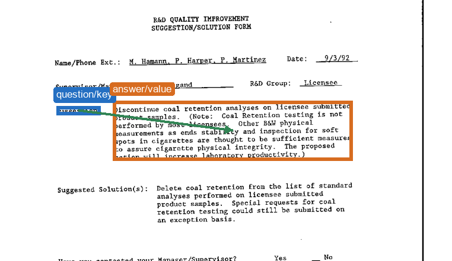
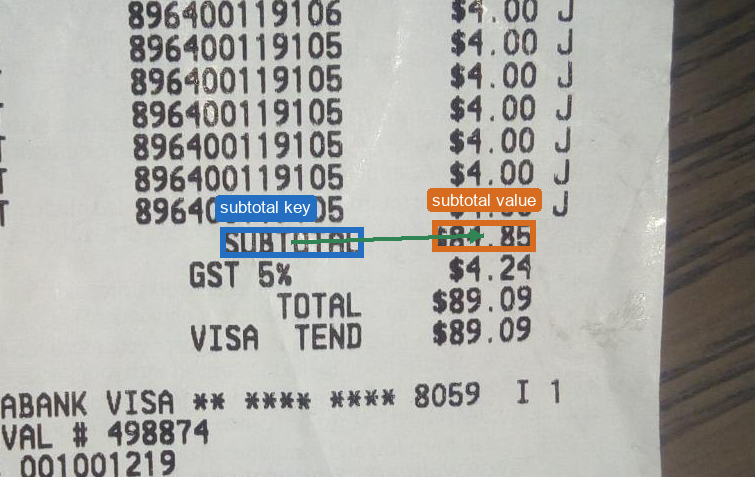
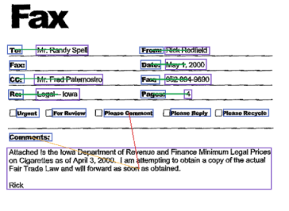

# GNN for Key-Value Pair Linking in Documents

Experimental code for key-value pair (KVP) extraction in document images, with
the main focus on a lightweight GNN trained and evaluated on public KVP
benchmarks.

**Authors:** Gabriel Sichelero and Ricardo Dutra da Silva.


The diagram above shows the broader end-to-end document-processing pipeline
used in the local pipeline experiments. Its OCR, table-structure, semantic
normalization, and visualization components are kept under `scripts/other/`.
The main reproducible path in this repository is narrower: converting public
KVP datasets to a shared relation target and training/evaluating the GNN.

## Objective

The repository is centered on two reproducible pieces:

1. Mapping WildReceipt into the same FUNSD-style representation used by the
   GNN experiments, so cross-dataset and combined-dataset training can be run in
   one format.
2. Training and testing the custom GNN for KVP linking, using document entities
   as nodes and candidate key-value relations as edges.

Datasets, checkpoints, large generated outputs, and private documents are not
included. The code expects local datasets to be provided through paths or
environment variables.

## KVP Relation Examples

The public experiments first convert different annotation styles into the same
directed relation target. FUNSD already provides entity links, while
WildReceipt provides typed key/value classes. Both are represented as directed
key/question -> value/answer edges for training and evaluation.





The example below shows a FUNSD document processed by the GNN for key-value
relation prediction. Correct predicted links are shown in green, false
positives in red, and false negatives with yellow lines.



## Main Scripts

| File | Purpose |
| --- | --- |
| `scripts/kvp_gnn_cross_dataset.py` | Main experiment script. Converts WildReceipt to a FUNSD-style layout, trains/tests the custom GNN, and runs FUNSD/WildReceipt cross-dataset evaluation. |
| `scripts/kv_extractor_ml.py` | Support extractor for FUNSD-style annotations. It learns vocabulary and key-like terms from the training annotations instead of using fixed invoice keywords. |
| `scripts/other/` | Auxiliary local-pipeline scripts for OCR, semantic normalization, tables, and legacy invoice experiments. They are kept for reference, but are not the main reproduction path. |

## Reference Results

Reported GNN results on public KVP-linking benchmarks:

| Setting | Reported result |
| --- | --- |
| GNN trained and tested on FUNSD | F1 = 0.772 with approximately 890K parameters |
| GNN trained on FUNSD+WildReceipt and tested on FUNSD | F1 = 0.832 |
| GNN trained on FUNSD+WildReceipt and tested on WildReceipt | F1 = 0.721 |


## Data-Driven Configuration

The main scripts avoid document-specific hardcoded field names. In particular:

- `kv_extractor_ml.py` derives key-term hints from linked training annotations
  and saves those learned terms with the model.
- `scripts/other/invoice_categories.py` builds optional semantic-category
  vocabularies from local ground-truth category assignment files when they are
  available.
- WildReceipt label conversion uses the dataset label parity convention rather
  than a fixed list of label IDs.

## How to Run

Install dependencies:

```bash
pip install -r requirements.txt
```

Example commands from the repository root:

```bash
python scripts/kvp_gnn_cross_dataset.py
python scripts/kv_extractor_ml.py --train --annotation-dir path/to/funsd/training_data/annotations
```

Useful environment variables:

```bash
set DOCUMENT_KVP_PROJECT_ROOT=C:\path\to\repository-or-data
set KVP_DATASETS_DIR=C:\path\to\kvp_datasets
set KVP_RESULTS_DIR=C:\path\to\results
set KVP_ANNOTATION_DIR=C:\path\to\funsd\training_data\annotations
```

On Linux/macOS, use `export` instead of `set`.

## Expected Data

Full experiment runs may require:

- FUNSD;
- WildReceipt;
- optional previously trained checkpoints for evaluation-only runs.

These files are not redistributed here. This repository intentionally contains
only source code, documentation, and lightweight figures.

## Structure

```text
.
|-- README.md
|-- requirements.txt
|-- assets/
|   |-- pipeline_architecture_paper.png
|   |-- invoice_kvp_annotations_anon.png
|   |-- kvp_public_protocol_paper.png
|   |-- kvp_shared_target_funsd.png
|   |-- kvp_shared_target_wildreceipt.png
|   `-- kvp_error_vertical_alignment.png
`-- scripts/
    |-- kvp_gnn_cross_dataset.py
    |-- kv_extractor_ml.py
    `-- other/
        |-- invoice_categories.py
        |-- locator_classifier.py
        |-- run_full_pipeline_with_semantic_context.py
        |-- semantic_normalization_gt_context.py
        |-- semantic_normalization_suite.py
        |-- table_structure_detector.py
        |-- test_full_pipeline.py
        `-- unified_document_pipeline.py
```
